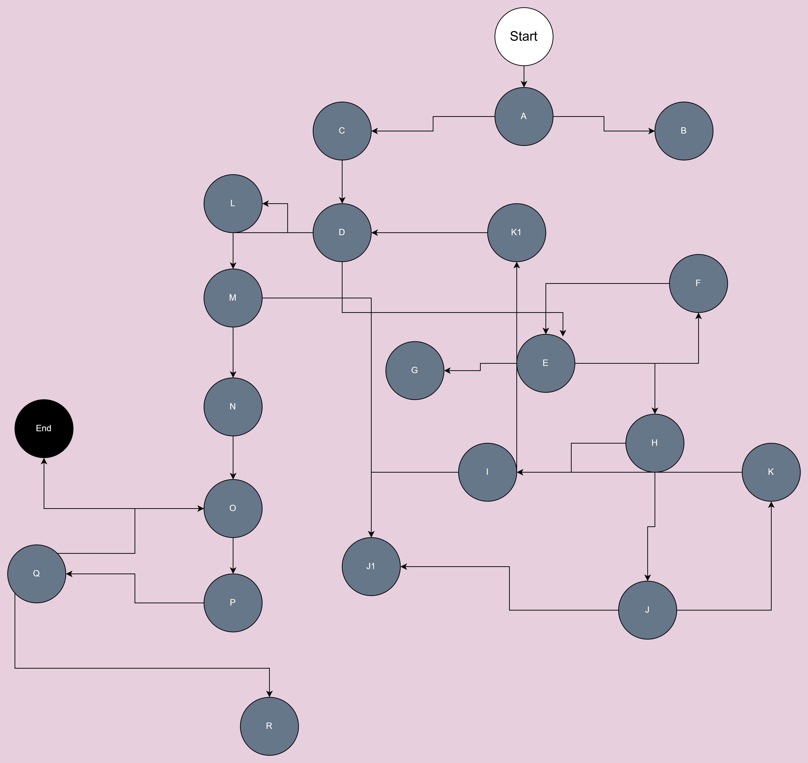

## 2. Control Flow Graph

Дијаграмот го изработив со алатката draw.io. 
Во продолжение е сликата од CFG за функцијата `checkCart`:


## 3. Цикломатска комплексност

Цикломатската комплексност е метрика која се користи за мерење на логичката комплексност на програмскиот код. Таа покажува колку независни патишта постојат низ кодот, што воедно укажува и на минималниот број на тест случаи што се потребни за целосно структурно тестирање на функцијата.

Се пресметува со формулата:

**M = E - N + 2P**

каде што:
- **E** е бројот на рабови (edges)
- **N** е бројот на јазли (nodes)
- **P** е бројот на поврзани компоненти (во овој случај 1, бидејќи имаме една функција)

### Пресметка:

- E = 26 (број на рабови)
- N = 17 (број на јазли)
- P = 1 (една компонента)

**Резултат: M = 26 - 17 + 2*1 = 11**

### Резултат:

Цикломатската комплексност на функцијата `checkCart` изнесува **11**.  
Тоа значи дека се потребни **најмалку 11 тест случаи** за да се покријат сите независни логички патишта во функцијата.

# 4. Тест случаи според Every Statement критериумот

Every Statement критериумот бара секоја линија од кодот да се изврши барем еднаш. За да го постигнеме тоа, ги напишав следниве тест случаи:

| Бр. | Опис на тест случајот                               | Очекуван резултат                              |
|-----|----------------------------------------------------|------------------------------------------------|
| 1   | Влезна листа е `null`                              | Исклучок: `allItems list can't be null!`       |
| 2   | `Item` со `null` име                               | Исклучок: `Invalid item!`                      |
| 3   | Неважечки број на картичка (краток број)           | Исклучок: `Invalid card number!`               |
| 4   | `Item` со цена > 300 (се активира -30 правило)     | Резултат: `400 * 5 - 30 = 1970.0`              |
| 5   | Валиден `Item`, но картичката содржи нецифрен знак | Исклучок: `Invalid character in card number!`  |
| 6   | Валиден `Item` и валиден број на картичка          | Резултат: `2 * 50 = 100.0`                     |

**Минимален број на тест случаи: 6**


# 5. Тест случаи според Multiple Condition критериумот

За условот:

```java
if (item.getPrice() > 300 || item.getDiscount() > 0 || item.getQuantity() > 10)

Постојат три логички подуслови:
item.getPrice() > 300    item.getDiscount() > 0   item.getQuantity() > 10

Целта е да се тестираат сите можни комбинации од овие три услови за да се постигне Multiple Condition Coverage.

Минимален број на тест случаи:
За три логички подуслови, минималниот број тест случаи според Multiple Condition Coverage е 4. Со овие тест случаи ги опфативме сите можни комбинации што влијаат на исходот од условот.


Објаснување на тест случаите:

Тест случај 1 го проверува ефектот кога само цената е висока.

Тест случај 2 го проверува ефектот кога само постои попуст.

Тест случај 3 го проверува ефектот кога само количината е поголема од 10.

Тест случај 4 е негативен тест кој ја проверува ситуацијата кога ниту еден од условите не е исполнет и затоа не треба да се одземаат 30 од сумата.

Овие тестови гарантираат дека секој дел од сложениот услов е испитан и дека кодот реагира правилно во сите можни варијации.

